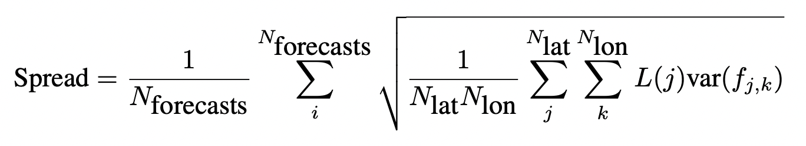
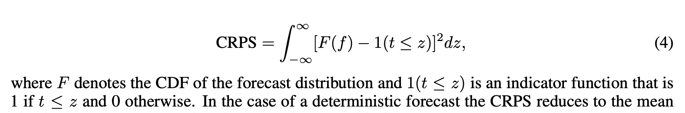
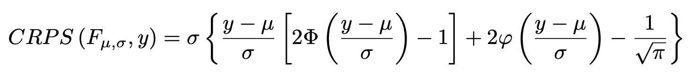
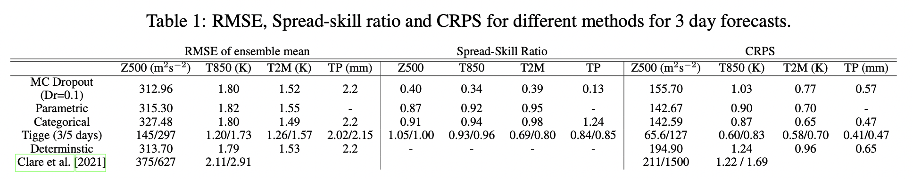

# WeatherBench Probability: A benchmark dataset for probabilistic medium-range weather forecasting along with deep learning baseline models

## Overview
This paper presents:
- a probabilistic extension to original weatherbench paper 
	- set of probabilistic verification metrics
		- continuous ranked probability score
		- spread-skill ratio
		- rank histograms
	- state-of-the-art operation baseline using ECWMF IFS ensemble forecast
- experiments with 3 probabalistic models:
	- Monte Carlo dropout
	- parametric prediction
	- categorical prediction

## Evaluation Metrics
### Spread-Skill Ratio

- measures reliability
- var($f,_{j,k}$): variance in the ensemble direction
- perfectly reliable model has ratio of 1
	- smaller values = underdispersion (overconfidence)
	- larger values = overdispersion

### CRPS

- if forecast is deterministic, CPRS is just the mean absolute error

### Rank Histograms

## Probabilistic neural networks
### Some Info
- deep Resnet used as basic network architecture with only the final layer changed
- **input variables**: at time $t, t-6h, t-12h$
	- 3D
		- geopotential, temperature, zonal and meridional wind, humidity
		- seven vertical levels: 50, 250, 500, 600, 700, 850, and 925 hPa
	- 2D
		- 2m temperature, 6hr accumulated preciptation, top-of-atmospher incoming solar radiation
	- constant (time invariant)
		- land-sea mask, orography, latitude at grid point
	- variables, levels, time steps stacked to create 114 channel input
	- all features normalized except precipitation
- train/val/test split (ERA5 at 5.625 deg)
	- train: 1979 to 2015
	- validation: 2016
	- test: 2017, 2018

### Monte Carlo Dropout
- dropout rates used: 0, 0.1, 0.2, 0.5
- drop out used during training and inference to create a stochastic prediction
	- created "50 random realizations for the test dataset to match the 50-member IFS ensemble"

### Parametric Prediction
- predict parameters of distribution
	- Z500, T850, T2M ~ $N(\mu, \sigma)$ ($\sigma$ is variance in this paper for some reason...)
- CRPS used as probabilistic loss function
  - closed form, differentiable solution of CRPS: 
- no stable distribution could be found for precipitation
- created randomly sampled 50-member ensemble for rank histogram (CRPS, spread-skill ratio calculated directly from predicted parametric distributions)

### Categorical Prediction
- divide value range into discrete bins then predict probability of each bin --> multi-class classification problem
- loss function: categorical cross-entropy 
- trade-off between bin width (= probabilistic resolution) and number of bins
- due to limits in the number of channels and fluctuations in values, to avoid large bins, $\Delta t$ and $\Delta z$ predicted instead of $t,z$.
	- difference added for evalution
- separate training for each variable

## Results

- mean RMSE and CRPS lowest for dropout rate of 0.1
- spread-skill ratio shows that dropout ensemble is severely underdispersive for all variables
- spread skill ratio close to one for parametric and categorical models

### Insights from rank histograms
- very strong U-shape for MC dropout
- parametric predictions are skewed --> high-bias. 
- categorical predictions do not have a bias and are only moderately U-shaped, suggesting good calibration

## Link to Paper
- [web-link](https://arxiv.org/pdf/2205.00865.pdf)

#cs 

